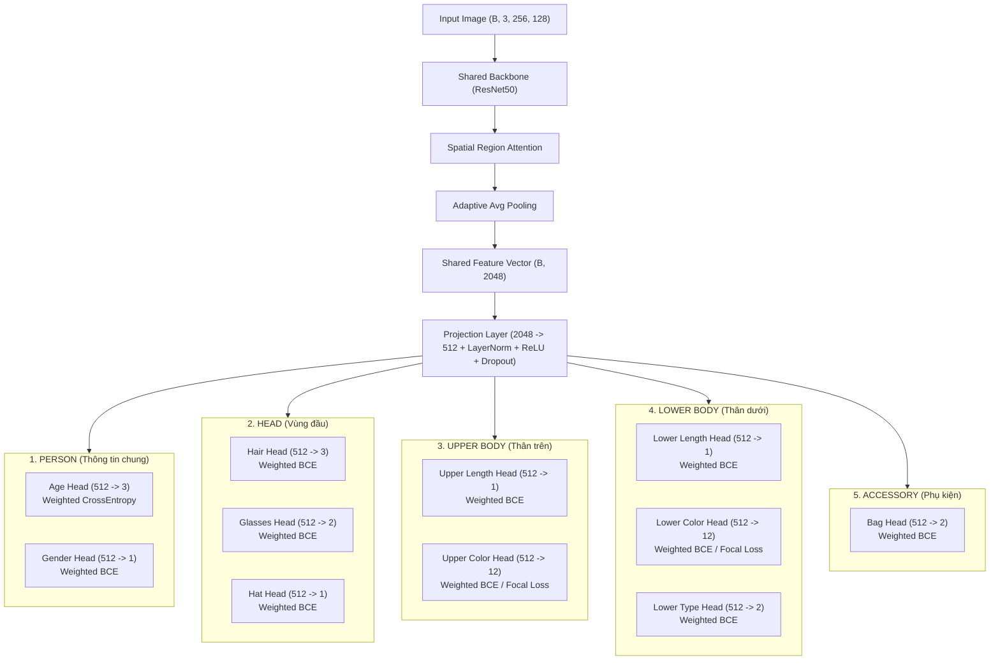

# UPAR Multi-Head Pedestrian Attribute Recognition

Hệ thống nhận diện thuộc tính người đi bộ (Pedestrian Attribute Recognition - PAR) huấn luyện trên bộ dữ liệu hợp nhất **UPAR_UNIFIED** (Market1501 + PA100k + PETA, 145,656 mẫu, 40 thuộc tính nhị phân gốc).

Dự án phát triển theo mô hình **Phân loại Đa nhãn (Multi-Label) kết hợp Đa lớp (Multi-Class) và Nhị phân (Binary Classification)** thông qua kiến trúc **Multi-Task / Multi-Head** với 11 head chuyên biệt theo 5 vùng ngữ nghĩa cơ thể người.

---

## Bản chất Bài toán & Phương án Xử lý Ảnh

> [!IMPORTANT]
> **Phương án Xử lý Ảnh hiện tại**: Mô hình theo **Phương án A (Một crop toàn thân - Single Full-body Crop)**.
> - **Input**: Nhận 1 ảnh toàn thân duy nhất ($256 \times 128$).
> - **Feature Extractor**: Tích hợp module **Spatial Attention** để tự động chú ý vào từng vùng cơ thể (Đầu, Thân trên, Thân dưới) trên Feature Map mà không cần cắt ảnh vật lý ở bước tiền xử lý.
> - **Đầu ra**: 11 Classification Heads dự đoán đồng thời 40 thuộc tính người đi bộ.

### Phân loại Nhiệm vụ Phân loại (Classification Nature)
1. **Tổng thể bài toán**: Phân loại **Đa nhãn (Multi-Label Classification)** cho 40 thuộc tính (vì một người đi bộ có thể vừa mang balo, vừa mặc áo đỏ, vừa đeo kính...).
2. **Head `age`**: Phân loại **Đa lớp (Multi-Class Classification)** loại trừ lẫn nhau cho 3 nhóm tuổi (Young, Adult, Old) sử dụng `Softmax` + `CrossEntropyLoss`.
3. **10 Heads còn lại**: Phân loại **Nhị phân (Binary / Multi-label Binary Classification)** cho từng thuộc tính (như `gender`, `hat`, `upper_color`, `lower_color`, `bag`, `glasses`...) sử dụng `Sigmoid` + `BCEWithLogitsLoss` / `FocalLoss`.

---

## Sơ đồ Pipeline Hệ thống (High-Level System Overview)

```mermaid
flowchart LR
    subgraph Data ["1. Data Pipeline"]
        Imgs["Ảnh người đi bộ\n(Market1501, PA100k, PETA)"] --> Loader["UPARDataset Loader\n& Indexing"]
        Labels["40 Nhãn UPAR"] --> TargetBuilder["Target Builder\n(Gom nhãn cho 11 Heads)"]
    end

    subgraph Model ["2. Multi-Head PAR Model"]
        Loader & TargetBuilder --> Backbone["ResNet50 Backbone\n+ Spatial Attention"]
        Backbone --> Proj["Shared Projection\n(512-dim)"]
        Proj --> Heads["11 Classification Heads\n(5 Vùng cơ thể)"]
    end

    subgraph Train ["3. Huấn luyện & Loss"]
        Heads --> LossFn["MultiHeadPARLoss\n(Weighted CE + BCE + Focal)"]
        LossFn --> Opt["AdamW (Differential LR)"]
        Opt --> Checkpoint["Checkpoints\n(checkpoints/hydraplus_upar_best.pth)"]
    end

    subgraph Output ["4. Kết quả & Suy luận"]
        Checkpoint --> Eval["Đánh giá Test/Val\n-> Xuất file reports/"]
        Checkpoint --> Infer["Predict 1 ảnh & Filter Gallery\n(predict_image / filter_pedestrians)"]
    end

    subgraph Tracking ["5. Video Tracking, Re-ID & Hybrid Matching (Level 1 - 4)"]
        Video["Video / Webcam\n(tracking/test_videos/*)"] --> Tracker["YOLOv8 + ByteTrack\n(tracking/track.py - L1)"]
        Tracker --> CSVTracks["Structured Tracks CSV\n(reports/tracking/<ten_video>/tracks.csv)"]
        CSVTracks --> CropExt["Extract Person Crops\n(tracking/extract_crops.py - L2)"]
        CropExt --> TrackAttr["Track Attribute Aggregation\n(tracking/track_attributes.py - L2)"]
        Checkpoint --> TrackAttr
        CropExt --> ReID["OSNet MSMT17 Extractor\n(tracking/reid_embedding.py - L3)"]
        ReID --> Emb["512-dim Re-ID Vector"]
        TrackAttr & Emb --> Hybrid["Hybrid Matcher & LOOCV\n(tracking/hybrid_matching.py - L4)"]
        Hybrid --> Summary["Tracked Persons Summary & JSON\n(reports/tracking/<ten_video>/attributes.json)"]
    end
```



---

## 1. Tổng quan Kiến trúc Mô hình

Mô hình **`UnifiedPARModel`** ([models/hydraplus/par_model.py](file:///c:/Users/ADMIN/OneDrive/Documents/GitHub/AI-Project/models/hydraplus/par_model.py)) tổ chức theo cấu trúc **2 Tầng phân cấp (2-Level Hierarchy)**:

1. **Tầng 1 (Body Regions - 5 Vùng cơ thể)**: Nhóm 40 thuộc tính UPAR theo phân vùng ngữ nghĩa (`PERSON`, `HEAD`, `UPPER BODY`, `LOWER BODY`, `ACCESSORY`).
2. **Tầng 2 (Classification Heads - 11 Đầu ra phân loại)**: Phân nhánh kỹ thuật với số chiều và hàm Loss tối ưu cho từng bài toán nhị phân/đa lớp.



### Bảng cấu trúc 11 Classification Heads

| Vùng cơ thể (Body Region) | # | Head Name | Attributes Chi Tiết | Out Dim | Loại bài toán | Loss Function & Kỹ thuật |
|---|---|---|---|---|---|---|
| **PERSON** (Thông tin chung) | 1 | `age` | Young, Adult, Old | 3 | Multi-class | `CrossEntropyLoss` (Weighted) |
| | 2 | `gender` | Female | 1 | Binary | `BCEWithLogitsLoss` (pos_weight) |
| **HEAD** (Vùng đầu) | 3 | `hair` | Short, Long, Bald | 3 | Multi-label Binary | `BCEWithLogitsLoss` (pos_weight) |
| | 4 | `glasses` | Normal, Sun | 2 | Multi-label Binary | `BCEWithLogitsLoss` (pos_weight) |
| | 5 | `hat` | Hat | 1 | Binary | `BCEWithLogitsLoss` (pos_weight) |
| **UPPER BODY** (Thân trên) | 6 | `upper_length` | Short Sleeve | 1 | Binary | `BCEWithLogitsLoss` (pos_weight) |
| | 7 | `upper_color` | 12 màu (Black..Other) | 12 | Multi-label Binary | `BCEWithLogitsLoss` / `FocalLoss` |
| **LOWER BODY** (Thân dưới) | 8 | `lower_length` | Short | 1 | Binary | `BCEWithLogitsLoss` (pos_weight) |
| | 9 | `lower_color` | 12 màu (Black..Other) | 12 | Multi-label Binary | `BCEWithLogitsLoss` / `FocalLoss` |
| | 10 | `lower_type` | Trousers&Shorts, Skirt&Dress | 2 | Multi-label Binary | `BCEWithLogitsLoss` (pos_weight) |
| **ACCESSORY** (Phụ kiện) | 11 | `bag` | Backpack, Bag | 2 | Multi-label Binary | `BCEWithLogitsLoss` (pos_weight) |

---

## 2. Cấu trúc Thư mục Dự án

```text
.
├── 3 Datasets/                     # Dữ liệu ảnh người đi bộ gốc (Market1501, PA100k, PETA)
├── UPAR_UNIFIED/                   # Thư mục dữ liệu UPAR hợp nhất
│   ├── annotations/                # Unified annotations (train, val, test.pkl)
│   ├── mapping/                    # Mapping JSON từ các bộ dữ liệu gốc
│   └── scripts/                    # Scripts gộp và kiểm tra dữ liệu
├── configs/
│   └── upar.yaml                   # Cấu hình loss_weights, hyperparameters
├── datasets/
│   └── upar/
│       └── loader.py               # UPARDataset, HEAD_SPECS, Target Builder
├── models/
│   └── hydraplus/
│       ├── backbone.py             # Feature Extractor (ResNet50)
│       └── par_model.py            # UnifiedPARModel (SpatialAttention + 11 Heads)
├── tracking/                       # Module Video Tracking, Re-ID & Hybrid Matching (Level 1 - 4)
│   ├── track.py                    # Level 1: YOLOv8 + ByteTrack tracking pipeline
│   ├── extract_crops.py            # Level 2: Trích xuất crop người theo track_id
│   ├── track_attributes.py         # Level 2: Gom nhóm xác suất 40 thuộc tính UPAR
│   ├── reid_embedding.py           # Level 3: OSNet 512-dim embedding extractor
│   ├── reid_validate_domain.py     # Level 3: Validate similarity phân phối real video
│   ├── reid_validate_reentry.py    # Level 3: Validate Re-entry & Chống Pseudo-replication
│   ├── reid_validate_reentry_combined.py # Level 3: Benchmark Re-ID trên 4 video domain
│   ├── hybrid_matching.py          # Level 4: Hybrid Re-ID + Attribute + Time Penalty (LOOCV)
│   ├── demo_combined.py            # Video Demo Hợp nhất Level 1 + Level 2 + Level 3
│   ├── TECHNICAL_REPORT.md         # Báo cáo kỹ thuật & thực nghiệm chuyên sâu 4 Level
│   ├── README.md                   # Hướng dẫn chi tiết sử dụng module tracking
│   └── test_videos/                # Thư mục chứa các video test mẫu (.mp4, .avi)
├── training/
│   ├── loss.py                     # MultiHeadPARLoss (Weighted CE + BCE + FocalLoss)
│   ├── evaluate.py                 # Evaluator (mA, F1, Accuracy, Precision, Recall)
│   └── train.py                    # Training pipeline chính (Differential LR, AMP)
├── inference/
│   ├── predict_image.py            # Suy luận 1 ảnh, xuất bảng kết quả & vẽ chart
│   └── filter_pedestrians.py       # Truy vấn & lọc danh sách người theo thuộc tính
├── scratch/                        # Scripts kiểm toán & hỗ trợ điều tra 1 lần (audit trail)
├── checkpoints/
│   ├── hydraplus_upar_best.pth     # Checkpoint UPAR PAR Model tốt nhất
│   ├── osnet_x1_0_msmt17.pth       # Checkpoint OSNet Re-ID Model (512-dim)
│   └── yolov8n.pt                  # Checkpoint YOLOv8 Detector
├── reports/
│   ├── tracking/                   # Kết quả Tracking theo cấu trúc thư mục con
│   │   ├── demo/                   # Video demo duy nhất & 5 ảnh screenshot Re-ID
│   │   ├── crops/                  # Crop ảnh người theo track_id (crops/<ten_video>/track_<id>/)
│   │   ├── <ten_video>/            # 5 Thư mục video chính thức (tracks.csv, tracked.mp4, attributes.json, reentry_ground_truth.csv)
│   │   ├── _exploration_archive/   # Thư mục lưu trữ 7 video thử nghiệm audit trail
│   │   ├── _debug_images/          # Ảnh kiểm tra & debug trực quan
│   │   └── tracked_persons_summary.csv # Bảng tổng hợp đối tượng
│   ├── training_report.txt         # Báo cáo huấn luyện chi tiết
│   ├── metrics.csv                 # Tóm tắt chỉ số Test/Val
│   └── per_attribute_metrics.csv   # Chỉ số 40 thuộc tính
├── tests/
│   ├── test_dataset.py             # Test DataLoader & Target Builder
│   ├── test_model.py               # Test Forward Pass mô hình
│   └── test_training.py            # Test Forward + Loss + Backward Pass
└── README.md
```

---

## 3. Cài đặt & Môi trường

### Bước 1 — Kích hoạt Môi trường ảo (Virtual Environment)
```powershell
.\.venv\Scripts\Activate.ps1
```

### Bước 2 — Cài đặt Dependencies
```powershell
pip install -r requirements.txt
```

---

## 4. Huấn luyện Mô hình (Training)

Chạy lệnh huấn luyện pipeline chính:
```powershell
python training/train.py --epochs 10 --batch_size 64
```

### Kỹ thuật Huấn luyện Nổi bật:
1. **Differential Learning Rate**:
   - Backbone ResNet50 & Spatial Attention: `lr = 3e-5` (`args.lr * 0.1`) để giữ đặc trưng pre-trained ImageNet.
   - 11 Classification Heads & Projection Layer: `lr = 3e-4`.
2. **Cơ chế Cân bằng Lớp (Class Imbalance Handling)**:
   - Tự động tính `pos_weight` cho BCE loss dựa trên công thức căn bậc hai tỉ lệ mẫu âm/dương: $\text{pos\_weight} = \text{clip}\left(\sqrt{\frac{N_{\text{neg}}}{N_{\text{pos}}}}, 0.5, 50.0\right)$.
   - Tự động tính trọng số lớp nghịch đảo tần suất (`inverse frequency`) cho Age CrossEntropy.
   - Hỗ trợ **`BinaryFocalLossWithLogits`** cho các heads có độ lệch nhãn cao (`upper_color`, `lower_color`).
3. **Lưu trữ Checkpoint Tự động**:
   - Đánh giá liên tục sau mỗi epoch trên tập Validation, tự động lưu model có `val_mA` cao nhất vào [`checkpoints/hydraplus_upar_best.pth`](file:///c:/Users/ADMIN/OneDrive/Documents/GitHub/AI-Project/checkpoints/hydraplus_upar_best.pth).

---

## 5. Đánh giá Mô hình (Evaluation)

Chạy script đánh giá chuyên sâu trên tập dữ liệu Test hoặc Val:
```powershell
python training/evaluate.py --checkpoint checkpoints/hydraplus_upar_best.pth
```

### Các chỉ số chính:
* **mA (mean Accuracy)**: Chỉ số tiêu chuẩn cho PAR, trung bình accuracy của 40 thuộc tính nhằm chống lệch nhãn.
* **Accuracy / Precision / Recall / F1-score**: Đánh giá toàn diện theo 40 thuộc tính và theo 11 heads.
* Các báo cáo được tự động ghi vào `reports/metrics.csv` và `reports/per_attribute_metrics.csv`.

---

## 6. Kết quả Huấn luyện Thực tế Nổi bật

Dưới đây là kết quả thực tế trên bộ dữ liệu UPAR (100,593 mẫu Train, 15,021 mẫu Val, 30,042 mẫu Test):

| Chỉ số tổng thể | Giá trị đạt được |
|---|---|
| **Best Validation mA** | **83.19%** |
| **Test mA** | **82.76%** |
| **Test Accuracy** | **94.19%** |
| **Test F1-score** | **63.04%** |

### Đánh giá theo 11 Classification Heads:

| # | Head Name | Accuracy | F1-score | Đánh giá hiệu năng |
|---|---|---|---|---|
| 1 | `age` | **96.41%** | **96.41%** | Xuất sắc |
| 2 | `gender` | **91.28%** | **89.74%** | Xuất sắc |
| 3 | `hair` | **92.95%** | **89.13%** | Xuất sắc |
| 4 | `upper_length` | **92.67%** | **93.89%** | Xuất sắc |
| 5 | `upper_color` | **95.12%** | **72.82%** | Rất tốt |
| 6 | `lower_length` | **95.33%** | **93.20%** | Xuất sắc |
| 7 | `lower_color` | **95.15%** | **71.99%** | Rất tốt |
| 8 | `lower_type` | **94.39%** | **94.40%** | Xuất sắc |
| 9 | `bag` | **83.40%** | **67.15%** | Tốt |
| 10 | `glasses` | **90.07%** | **49.32%** | Khá (Mẫu hiếm) |
| 11 | `hat` | **97.67%** | **72.36%** | Rất tốt |

---

## 7. Hướng dẫn Suy luận & Sử dụng (Inference)

### 7.1. Nhận diện Thuộc tính trên 1 Ảnh đơn (`predict_image.py`)
```powershell
python inference/predict_image.py --image "path/to/image.jpg" --threshold 0.5
```
* **Đầu ra Terminal**: In bảng kết quả dự đoán chi tiết cho 11 heads và 40 thuộc tính kèm độ tin cậy (%).
* **Đầu ra Trực quan**: Tự động lưu biểu đồ cột trực quan tại `reports/result_<tên_ảnh>.png`.

### 7.2. Lọc & Truy vấn Người đi bộ theo Thuộc tính (`filter_pedestrians.py`)
Hệ thống hỗ trợ lọc danh sách ảnh đối tượng theo bất kỳ kết hợp thuộc tính ngữ nghĩa nào:

```powershell
# Lọc Nữ giới mặc Áo đỏ:
python inference/filter_pedestrians.py --gender female --upper_color red

# Lọc Người trẻ mang Balo:
python inference/filter_pedestrians.py --age young --bag backpack

# Lọc Phụ nữ mặc Váy:
python inference/filter_pedestrians.py --gender female --lower_type skirt
```
* Kết quả được xuất trực tiếp thành lưới ảnh người đi bộ phù hợp tại `reports/filter_result.png`.

---

## 8. Module Video Tracking, Re-ID & Hybrid Matching (Level 1 - 4)

Hệ thống theo dõi người đi bộ toàn diện trong video gồm **4 Level**:
1. **Level 1 (Detection & Tracking)**: YOLOv8 + ByteTrack (`tracking/track.py`).
2. **Level 2 (Attribute Aggregation)**: Trích crop & gom nhóm xác suất 40 thuộc tính UPAR (`tracking/extract_crops.py`, `tracking/track_attributes.py`).
3. **Level 3 (Re-ID Embedding)**: Trích 512-dim embedding OSNet MSMT17 & kiểm thử Re-entry (`tracking/reid_embedding.py`, `tracking/reid_validate_reentry_combined.py`).
4. **Level 4 (Hybrid Matching & Audit)**: Kết hợp Re-ID + Attribute + Time Penalty qua LOOCV Grid Search (`tracking/hybrid_matching.py`).

> Chi tiết hướng dẫn vận hành xem tại [`tracking/README.md`](file:///c:/Users/ADMIN/OneDrive/Documents/GitHub/AI-Project/tracking/README.md). Báo cáo phương pháp luận và kết quả nghiên cứu thực nghiệm 4 Level xem tại [`tracking/TECHNICAL_REPORT.md`](file:///c:/Users/ADMIN/OneDrive/Documents/GitHub/AI-Project/tracking/TECHNICAL_REPORT.md).

### 8.1. Chạy Tracking Baseline (Level 1)
```powershell
# Chạy tracking từ file video:
python tracking/track.py --source tracking/test_videos/real_pedestrians.mp4 --save-video

# Chạy tracking từ webcam:
python tracking/track.py --source 0 --show
```
* **Kết quả CSV**: Lưu tại `reports/tracking/<ten_video>/tracks.csv` (`frame_id,track_id,x1,y1,x2,y2,confidence,timestamp`).

### 8.2. Trích xuất Crop theo Track ID (Level 2)
```powershell
python tracking/extract_crops.py --video tracking/test_videos/real_pedestrians.mp4 --csv reports/tracking/real_pedestrians/tracks.csv --output-dir reports/tracking/crops/real_pedestrians --every-n-frames 5 --clean
```

### 8.3. Gán & Tổng hợp Thuộc tính UPAR (Level 2)
```powershell
python tracking/track_attributes.py `
  --crops-dir reports/tracking/crops/real_pedestrians `
  --tracks-csv reports/tracking/real_pedestrians/tracks.csv `
  --checkpoint checkpoints/hydraplus_upar_best.pth `
  --output-dir reports/tracking/real_pedestrians `
  --min-frames 3
```

### 8.4. Re-ID Embedding & Combined Re-Entry Benchmark (Level 3)
```powershell
# Trích xuất 512-dim embedding & validate Market1501:
python tracking/reid_embedding.py

# Benchmark bài toán Re-entry trên 4 video domain (Micro EER 9.67%, Macro EER 13.70%):
python tracking/reid_validate_reentry_combined.py
```

### 8.5. Hybrid Matching & LOOCV Evaluation (Level 4)
```powershell
python tracking/hybrid_matching.py
```

---

## 9. Bộ Kiểm thử Tự động (Unit Tests)

Chạy các bài unit test để đảm bảo tính toàn vẹn của mã nguồn:

```powershell
# Test DataLoader & Target Builder
python tests/test_dataset.py

# Test Forward Pass Mô hình
python tests/test_model.py

# Test Pipeline Train / Loss / Gradient
python tests/test_training.py
```

---

## 10. Cập nhật Định hướng Phát triển (Roadmap)

- [x] **Level 1**: YOLOv8 + ByteTrack Video Tracking baseline.
- [x] **Level 2**: Gom nhóm xác suất 40 thuộc tính UPAR qua các frame của `track_id`.
- [x] **Level 3**: Tích hợp Re-ID Embedding (OSNet 512-dim), đánh giá Re-entry chống Pseudo-replication ($N=12$ events trên 4 video domains).
- [x] **Level 4**: Hybrid Matching (Re-ID + Attribute + Time Penalty) đánh giá qua LOOCV Grid Search tránh Data Leakage.
- [ ] **Multi-Camera Global Tracking**: Mở rộng từ Single-camera Re-entry sang Multi-camera Global Re-ID với Feature Store (FAISS/Redis).
- [ ] **Person Retrieval Interface**: Phát triển UI / API truy vấn kết hợp lọc nhãn Thuộc tính (Attribute Filtering) và xếp hạng Re-ID (Re-ID Ranking).

